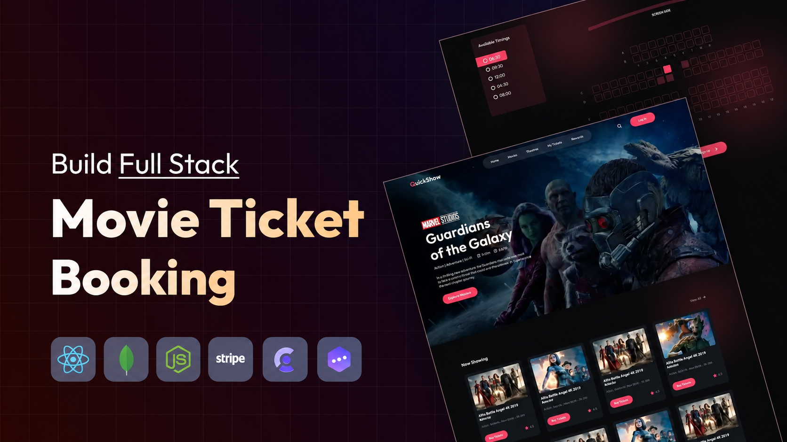
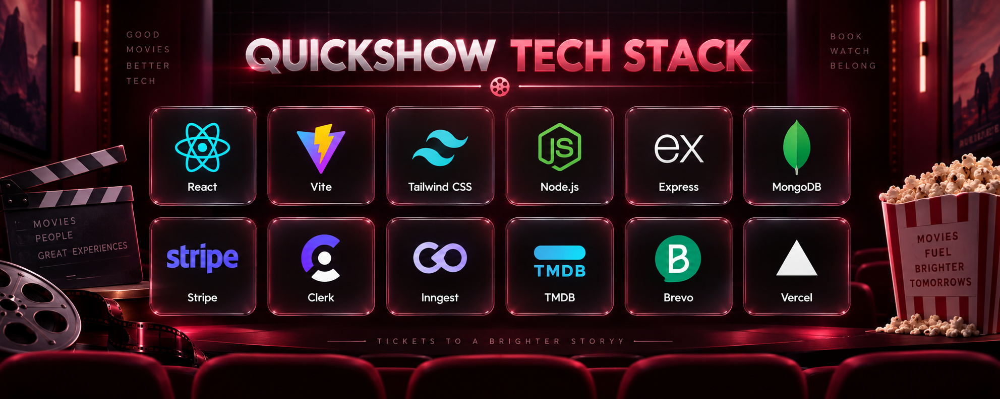
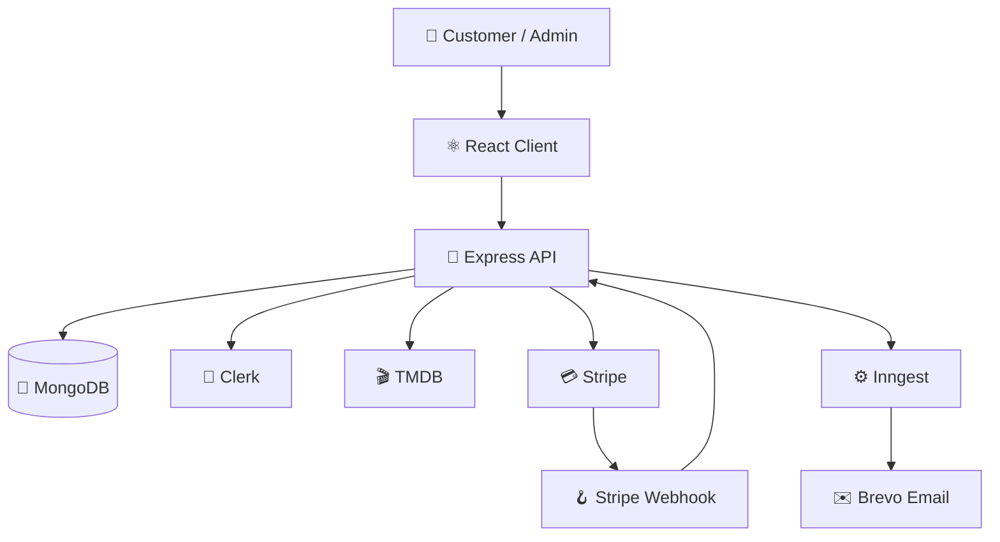

<!-- Repository: https://github.com/MuaddhAlsway/quickshowpro -->

<div align="center">


<br />



# 🎬 QuickShow Pro

### 🍿 Full-stack movie discovery, seat reservation, and cinema booking

<p>
  
  
  
  
</p>

<p>
  <a href="#-features">✨ Features</a> •
  <a href="#-technology-stack">🧰 Tech Stack</a> •
  <a href="#-getting-started">🚀 Setup</a> •
  <a href="#-api-overview">🔌 API</a>
</p>

</div>

---

## 📖 Project Overview

QuickShow Pro is a full-stack cinema platform combining movie discovery, show scheduling, interactive seat selection, secure checkout, booking management, and automated customer communication.

The React application lets customers browse movies, inspect showtimes, reserve seats, pay through Stripe Checkout, save favorites, and view bookings. Its protected administration area supports show creation, booking visibility, and business statistics.

The Express API coordinates Clerk authentication, MongoDB persistence, TMDB movie data, Stripe payment events, Inngest workflows, and transactional email through Brevo SMTP.

## ✨ Features

### 🎟️ Customer Experience

- 🎬 Browse available and upcoming movies.
- 🔍 View movie details, genres, cast, ratings, runtime, trailers, and showtimes.
- 📅 Select a show by date and time.
- 💺 Choose seats using an interactive cinema layout.
- 🔒 Reserve seats while payment is pending.
- 💳 Complete secure payment through Stripe Checkout.
- 🧾 Review personal bookings and payment status.
- ❤️ Add or remove favorite movies.
- 🔐 Sign in through Clerk authentication.
- 🔔 Receive toast feedback throughout the application.

### 🛠️ Administration

- 🛡️ Clerk-protected admin access with role-based authorization.
- 📊 Dashboard statistics for bookings, shows, users, and revenue.
- 🎞️ Import now-playing movie data from TMDB.
- ➕ Create shows with dates, times, and ticket prices.
- 📋 Review all upcoming shows and customer bookings.
- 🚫 Redirect unauthorized users away from admin routes.

### 💰 Payments and Reliability

- 💳 Stripe Checkout session creation.
- 🪝 Signed Stripe webhook verification using the raw request body.
- ✅ Payment confirmation only after Stripe verifies the transaction.
- ⌛ Pending, paid, expired, and cancelled booking states.
- ♻️ Payment reconciliation for missed or delayed events.
- 🪑 Automatic release of seats from expired unpaid bookings.
- 🔁 Idempotent payment and email workflows.

### 📧 Background Jobs and Email

- 🔄 Synchronize Clerk user creation, updates, and deletion with MongoDB.
- 📨 Send confirmation email after verified payment.
- ⏰ Schedule reminders 24 hours and 2 hours before showtime.
- 🔁 Retry pending confirmation emails using an Inngest cron function.
- 🧯 Skip invalid reminders for cancelled, expired, unpaid, missing, or started shows.
- ✉️ Send transactional messages with Nodemailer and Brevo SMTP.

## 🧰 Technology Stack

<div align="center">



</div>

<div align="center">

<!-- SVG technology icons -->
&nbsp;
&nbsp;
&nbsp;
&nbsp;
&nbsp;
&nbsp;
&nbsp;
&nbsp;


</div>

### 🖥️ Frontend

- ⚛️ **React 19** — component-based interface.
- ⚡ **Vite 8** — development and production builds.
- 🎨 **Tailwind CSS 4** — utility-first styling.
- 🧭 **React Router 7** — public, booking, and protected admin routing.
- 🔐 **Clerk React** — authentication and session tokens.
- 🌐 **Axios** — API communication.
- 🔔 **React Hot Toast** — user notifications.
- 🎥 **React Player** — trailer playback.
- 🖼️ **Lucide React** — interface icons.

### 🗄️ Backend

- 🟢 **Node.js** — server runtime.
- 🚂 **Express 5** — REST API and webhooks.
- 🍃 **MongoDB + Mongoose** — application persistence.
- 🔐 **Clerk Express** — authentication and admin checks.
- 💳 **Stripe** — checkout and payment webhooks.
- 🎬 **TMDB API** — now-playing movie data.
- ⚙️ **Inngest** — durable jobs, delayed work, and retries.
- ✉️ **Nodemailer + Brevo SMTP** — transactional email.
- ☁️ **Cloudinary** — media service dependency.
- 🚀 **Vercel** — deployment configuration.

## 🏗️ System Architecture



### 🔄 Booking Flow

1. 🎞️ The client loads movie and show information.
2. 📅 The customer selects a showtime and available seats.
3. 🎟️ The API creates a pending booking and reserves the seats.
4. 💳 Stripe Checkout handles payment.
5. 🪝 Stripe sends a signed webhook event.
6. ✅ The server reconciles the booking as paid.
7. 📨 Inngest sends the confirmation exactly once.
8. ⏰ Inngest schedules eligible reminders.
9. ♻️ Expired unpaid bookings are deleted and their seats released.

## 🗂️ Project Structure

```text
quickshowpro/
├── client/
│   ├── public/                 # 🌐 Public static files
│   ├── src/
│   │   ├── assets/            # 🖼️ Images, logos, and SVG assets
│   │   ├── components/        # 🧩 Shared UI components
│   │   │   └── admin/         # 🛡️ Admin components
│   │   ├── context/           # 🧠 Global state and API calls
│   │   ├── lib/               # 🧰 Formatting helpers
│   │   ├── pages/             # 📄 Customer pages
│   │   │   └── admin/         # 📊 Admin pages
│   │   ├── App.jsx            # 🧭 Routes and access control
│   │   └── main.jsx           # ⚛️ React entry point
│   └── package.json            # 📦 Frontend scripts
├── server/
│   ├── Controller/             # 🎮 Request controllers
│   ├── configs/                # ⚙️ Service configuration
│   ├── inngest/                # 🔄 Background functions
│   ├── middleware/             # 🛡️ Authorization
│   ├── models/                 # 🍃 Mongoose models
│   ├── routes/                 # 🔌 Express routes
│   ├── scripts/                # 🧹 Reconciliation utilities
│   ├── tests/                  # 🧪 Node test suites
│   ├── utils/                  # 🛠️ Email, payment, and reminders
│   └── server.js               # 🚂 API entry point
└── README.md                   # 📘 Documentation
```

## 🧭 Application Routes

### 🍿 Public Routes

| 🛣️ Route | 📄 View | 🎯 Purpose |
|---|---|---|
| `/` | 🏠 Home | Featured movies and trailers |
| `/movies` | 🎬 Movies | Browse the movie catalog |
| `/movies/:id` | 🔍 Movie Detail | View details and choose a show |
| `/buy-tickets/:id/:date` | 💺 Seat Layout | Select seats and begin checkout |
| `/mybookings` | 🎟️ My Bookings | View personal bookings |
| `/favorites` | ❤️ Favorites | View saved movies |

### 🛡️ Admin Routes

| 🛣️ Route | 📄 View | 🎯 Purpose |
|---|---|---|
| `/admin` | 📊 Dashboard | Platform statistics |
| `/admin/add-shows` | ➕ Add Show | Import a movie and schedule shows |
| `/admin/list-shows` | 🎞️ Show List | Review upcoming shows |
| `/admin/list-bookings` | 📋 Booking List | Review customer bookings |

## 🔌 API Overview

### 🎬 Show Endpoints

| 🔧 Method | 🛣️ Endpoint | 🔐 Access | 🎯 Purpose |
|---|---|---|---|
| `GET` | `/api/show/now-playing` | 🛡️ Admin | Fetch movies from TMDB |
| `POST` | `/api/show/add` | 🛡️ Admin | Create movie shows |
| `GET` | `/api/show/all` | 🌍 Public | Fetch upcoming movies |
| `GET` | `/api/show/:movieId` | 🌍 Public | Fetch a movie and showtimes |

### 🎟️ Booking Endpoints

| 🔧 Method | 🛣️ Endpoint | 🎯 Purpose |
|---|---|---|
| `POST` | `/api/booking/create` | Create a booking and checkout session |
| `GET` | `/api/booking/seats/:showId` | Fetch occupied seats |

### 👤 User Endpoints

| 🔧 Method | 🛣️ Endpoint | 🎯 Purpose |
|---|---|---|
| `GET` | `/api/user/bookings` | Fetch personal bookings |
| `POST` | `/api/user/update-favorites` | Update favorites |
| `GET` | `/api/user/favorites` | Fetch favorites |

### 📊 Admin Endpoints

| 🔧 Method | 🛣️ Endpoint | 🎯 Purpose |
|---|---|---|
| `GET` | `/api/admin/is-admin` | Validate the admin role |
| `GET` | `/api/admin/dashboard` | Fetch dashboard statistics |
| `GET` | `/api/admin/all-shows` | Fetch upcoming shows |
| `GET` | `/api/admin/all-bookings` | Fetch all bookings |

### 🪝 Integration Endpoints

| 🔧 Method | 🛣️ Endpoint | 🎯 Purpose |
|---|---|---|
| `POST` | `/api/stripe` | Receive verified Stripe events |
| `ALL` | `/api/inngest` | Serve Inngest functions |
| `GET` | `/api/test-public` | Verify public API availability |
| `GET` | `/` | Verify server availability |

## 🚀 Getting Started

### 📋 Prerequisites

- 🟢 Node.js 20 or newer
- 📦 npm
- 🍃 MongoDB Atlas database
- 🔐 Clerk application
- 💳 Stripe account
- 🎬 TMDB API token
- ⚙️ Inngest account
- ✉️ Brevo SMTP credentials

### 📥 Installation

```bash
git clone https://github.com/MuaddhAlsway/quickshowpro.git
cd quickshowpro
```

### 🔐 Client Environment

Create `client/.env`:

```env
VITE_BASE_URL=http://localhost:3000
VITE_CLERK_PUBLISHABLE_KEY=your_clerk_publishable_key
VITE_CURRENCY=$
```

### 🔑 Server Environment

Create `server/.env`:

```env
PORT=3000
MONGODB_URI=your_mongodb_connection_string
CLERK_SECRET_KEY=your_clerk_secret_key
TMDB_API_KEY=your_tmdb_bearer_token
STRIPE_SECRET_KEY=your_stripe_secret_key
STRIPE_WEBHOOK_SECRET=your_stripe_webhook_secret
BOOKING_CURRENCY=usd
INNGEST_EVENT_KEY=your_inngest_event_key
INNGEST_SIGNING_KEY=your_inngest_signing_key
SMTP_USER=your_brevo_smtp_user
SMTP_PASS=your_brevo_smtp_key
SENDER_EMAIL=your_verified_sender_email
SHOW_TIMEZONE=Asia/Riyadh
POSTER_BASE_URL=https://image.tmdb.org/t/p/w500
```

> ⚠️ Never commit real credentials or production secrets.

### ▶️ Run the Server

```bash
cd server
npm install
npm run dev
```

### 💻 Run the Client

```bash
cd client
npm install
npm run dev
```

The API defaults to `http://localhost:3000`; Vite normally starts at `http://localhost:5173`.

## 🧪 Testing

### 🧰 Server Tests

The Node test suites cover email templates, payment synchronization, and reminder scheduling.

```bash
cd server
npm test
```

### 🧹 Client Quality Checks

```bash
cd client
npm run lint
npm run build
```

## 🔐 Authentication and Admin Access

- 👤 Clerk manages sign-in and sessions.
- 🎫 The client attaches Clerk bearer tokens to protected requests.
- 🛡️ `protectAdmin` checks the authenticated Clerk user.
- 🏷️ Admin authorization requires `privateMetadata.role` to be `admin`.
- 🚫 Non-admin users are redirected away from `/admin`.

## 🗃️ Data Models

| 🧱 Model | 📝 Responsibility |
|---|---|
| 👤 `User` | Clerk-backed identity and favorites |
| 🎬 `Movie` | TMDB metadata, artwork, rating, and runtime |
| 🕒 `Show` | Movie, showtime, price, and occupied seats |
| 🎟️ `Booking` | User, show, seats, Stripe session, and payment state |
| 📨 `EmailEvent` | Idempotent email delivery tracking |

## ⚙️ Available Scripts

### ⚛️ Client Scripts

| ⌨️ Command | 🎯 Purpose |
|---|---|
| `npm run dev` | Start Vite |
| `npm run build` | Build the client |
| `npm run lint` | Run ESLint |
| `npm run preview` | Preview the build |

### 🟢 Server Scripts

| ⌨️ Command | 🎯 Purpose |
|---|---|
| `npm run dev` | Start with Nodemon |
| `npm start` | Start with Node.js |
| `npm test` | Run server tests |

## 🚀 Deployment

- 🌐 The client Vercel rewrite supports React Router navigation.
- 🖥️ The server exports Express for Vercel's Node runtime.
- 🪝 Configure Stripe to deliver production webhooks to `/api/stripe`.
- ⚙️ Synchronize Inngest functions through `/api/inngest`.
- 🔐 Configure all environment variables in the correct Vercel project.
- 🔗 Point `VITE_BASE_URL` to the deployed API before building.

## 🛡️ Reliability and Security

- 🔏 Stripe webhooks are registered before `express.json()`.
- ✅ Browser redirects never determine whether a booking is paid.
- ♻️ Reconciliation recovers missed or delayed payment events.
- 🔂 Email claims prevent duplicate messages.
- 🧹 Expired unpaid bookings release reserved seats.
- 🧼 Email templates escape dynamic HTML values.
- 🗝️ Secrets remain in server-side environment variables.
- 👮 Admin endpoints enforce server-side authorization.

## 🤝 Contributing

1. 🍴 Fork the repository.
2. 🌿 Create a branch: `git checkout -b feature/your-feature`.
3. 🧪 Test and lint the changes.
4. 💾 Commit with a clear message.
5. 📤 Push the branch.
6. 🔁 Open a pull request.

## 👨‍💻 Author

Built by **Muaddh Alsway**.

- 🐙 GitHub: [@MuaddhAlsway](https://github.com/MuaddhAlsway)
- 💼 Portfolio: [MU.LAB](https://mulab-theta.vercel.app/)

## ⭐ Support

If QuickShow Pro helped you, consider giving the repository a ⭐.

---

<div align="center">

### 🎬 Discover. Reserve. Pay. Enjoy.

Made with ❤️ by Muaddh Alsway

</div>
