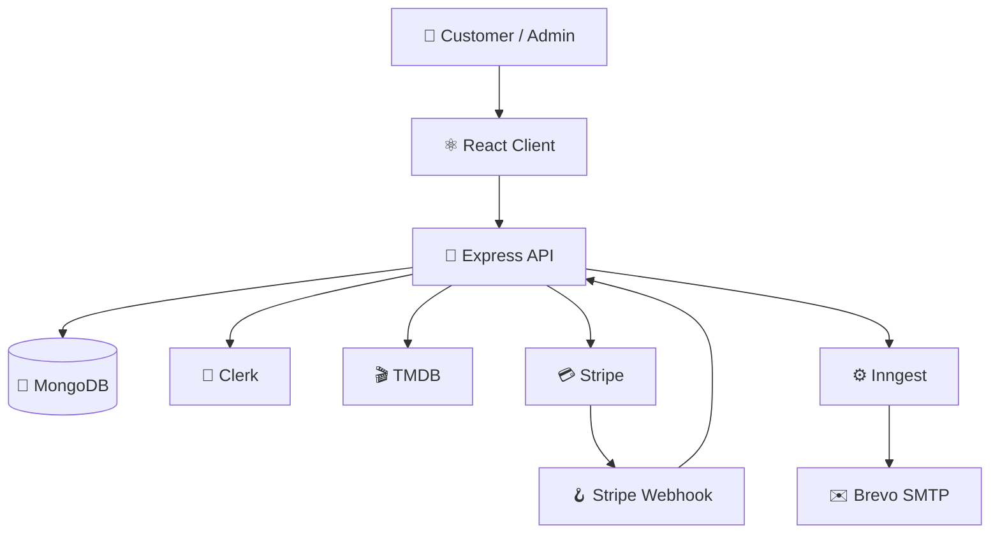
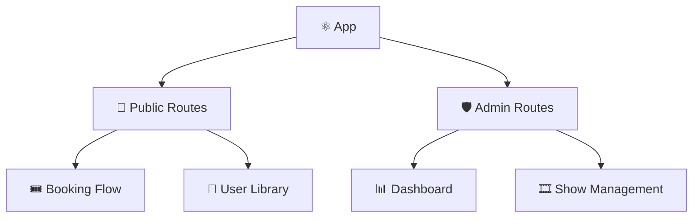
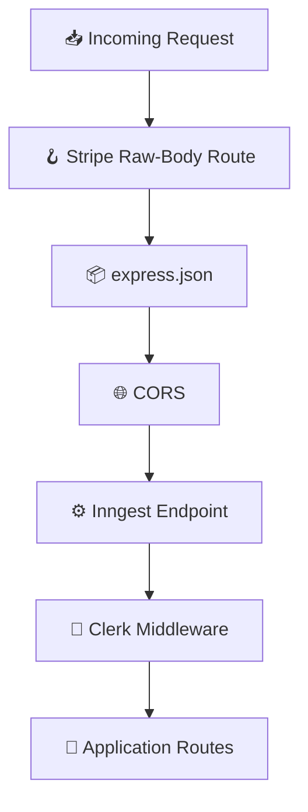
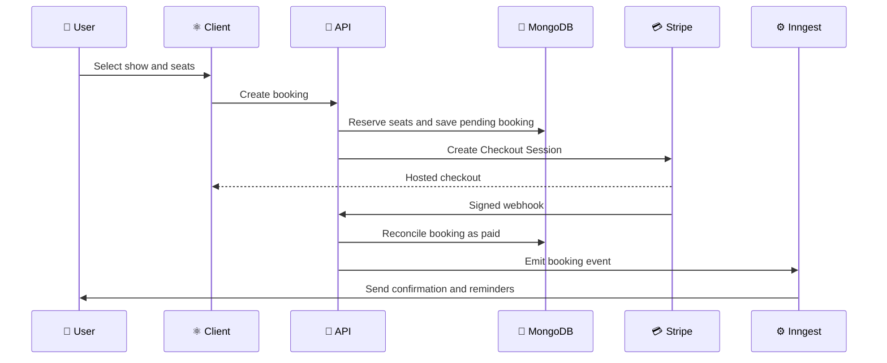
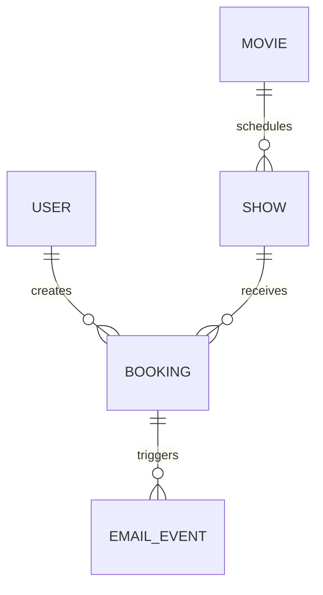

# 🏗️ QuickShow Pro — Architecture Lab

> 🎬 A technical map of the system structure, request flows, data models, external integrations, reliability mechanisms, and deployment design.

## 🧭 Architecture Overview

QuickShow Pro uses a decoupled client–server architecture:

- ⚛️ **React client** renders the customer and administration interfaces.
- 🚂 **Express API** owns business rules, protected operations, and integrations.
- 🍃 **MongoDB** persists users, movies, shows, bookings, and email events.
- 🔐 **Clerk** manages identity and supplies authenticated user sessions.
- 💳 **Stripe** manages hosted checkout and reports authoritative payment results.
- ⚙️ **Inngest** runs durable asynchronous workflows and scheduled reminders.
- ✉️ **Brevo SMTP** delivers confirmation and reminder emails through Nodemailer.
- 🎬 **TMDB** supplies current movie information.
- 🚀 **Vercel** hosts the frontend and backend as separate deployments.

## 🖥️ Frontend Architecture

### 🧩 Application Layers

| 🧱 Layer | 📁 Location | 🎯 Responsibility |
|---|---|---|
| 🚪 Entry | `client/src/main.jsx` | Mounts React and configures Clerk, Router, and context providers |
| 🧭 Routing | `client/src/App.jsx` | Defines public routes, admin routes, loading states, and redirects |
| 🧠 State | `client/src/context/AppContext.jsx` | Shares authentication, API data, favorites, shows, and admin state |
| 📄 Pages | `client/src/pages/` | Implements customer-facing screens |
| 🛡️ Admin pages | `client/src/pages/admin/` | Implements dashboard, show creation, show list, and booking list |
| 🧩 Components | `client/src/components/` | Reusable navigation, cards, hero, trailer, and layout elements |
| 🧰 Utilities | `client/src/lib/` | Formats dates, times, and numeric values |

### 🧭 Route Topology

### 🔐 Client Authentication Flow

1. 👤 Clerk loads the current session and user.
2. 🎫 The client requests a Clerk token through `getToken()`.
3. 📤 Axios sends the token as `Authorization: Bearer <token>`.
4. 🛡️ The admin check calls `GET /api/admin/is-admin`.
5. ⏳ The UI waits while Clerk and the role request are loading.
6. ✅ Admin users enter the nested admin layout.
7. 🚫 Non-admin users are redirected to the home page.

## 🚂 Backend Architecture

### 🧱 Server Layers

| 🧱 Layer | 📁 Location | 🎯 Responsibility |
|---|---|---|
| 🚪 Application | `server/server.js` | Middleware order, integrations, routes, local listener, and Vercel export |
| 🔌 Routes | `server/routes/` | Maps HTTP methods and paths to controllers |
| 🎮 Controllers | `server/Controller/` | Executes request-level business logic |
| 🛡️ Middleware | `server/middleware/` | Applies admin authorization |
| 🍃 Models | `server/models/` | Defines MongoDB document structures |
| ⚙️ Jobs | `server/inngest/` | Runs durable events, retries, delayed work, and reminders |
| 🧰 Utilities | `server/utils/` | Implements payment reconciliation, reminders, and email templates |
| 🔧 Configuration | `server/configs/` | Connects MongoDB, Inngest, and SMTP |

### 🧵 Express Middleware Order

Middleware order is important because Stripe requires the untouched request body.

## 🎟️ Booking and Payment Architecture

### 💳 Booking Lifecycle

### 🛡️ Payment Invariants

- ✅ The browser redirect never decides whether a booking is paid.
- 🔏 Webhook signatures are verified against the raw body.
- 💳 Stripe remains the authoritative payment source.
- ♻️ Reconciliation repairs missed or delayed local payment state.
- 🔁 Repeated events must not duplicate payment or notification side effects.
- 🪑 Expired unpaid bookings release their occupied seats.

### 🔄 Payment States

| 🏷️ State | 📝 Meaning |
|---|---|
| ⏳ `PENDING` | Checkout exists but payment is not confirmed |
| ✅ `PAID` | Stripe confirmed the payment |
| ⌛ `EXPIRED` | Checkout expired without successful payment |
| ❌ `CANCELLED` | Booking is no longer active |

## 🍃 Data Architecture

| 🧱 Model | 🔑 Important Data |
|---|---|
| 👤 `User` | Clerk ID, name, email, image, favorites |
| 🎬 `Movie` | TMDB ID, title, overview, artwork, genres, cast, rating, runtime |
| 🕒 `Show` | Movie reference, datetime, price, occupied-seat map |
| 🎟️ `Booking` | User, show, seats, amount, currency, Stripe session, payment status |
| 📨 `EmailEvent` | Booking, email kind, status, attempts, delivery timestamps |

## ⚙️ Background Workflow Architecture

### 🔄 Registered Inngest Functions

- 👤 Synchronize a newly created Clerk user.
- 🗑️ Delete a local user after Clerk deletion.
- ✏️ Update a local user after Clerk changes.
- 🪑 Release seats and delete an expired unpaid booking.
- 📨 Send the booking confirmation email.
- 🔁 Retry pending confirmation emails every five minutes.
- ⏰ Send the 24-hour movie reminder.
- ⌛ Send the 2-hour movie reminder.

### 📨 Idempotent Email Delivery

1. 🧾 A persistent `EmailEvent` represents the intended delivery.
2. 🔒 A worker claims the event before sending.
3. ✉️ Only the successful claimant sends the message.
4. ✅ The worker marks the event as completed.
5. 🔁 Stale or pending events can be retried safely.
6. 🚫 Already-completed deliveries are skipped.

## 🔌 API Boundaries

| 🧭 Boundary | 🔌 Base Path | 🎯 Responsibility |
|---|---|---|
| 🎬 Shows | `/api/show` | TMDB movies, show creation, show discovery |
| 🎟️ Bookings | `/api/booking` | Booking creation and occupied seats |
| 👤 Users | `/api/user` | User bookings and favorites |
| 🛡️ Admin | `/api/admin` | Role validation, dashboard, shows, bookings |
| 💳 Stripe | `/api/stripe` | Payment webhook processing |
| ⚙️ Inngest | `/api/inngest` | Background function serving |

## 🚀 Deployment Architecture

| 🌐 Service | 🔗 Deployment |
|---|---|
| ⚛️ Frontend | [quickshowprofront.vercel.app](https://quickshowprofront.vercel.app/) |
| 🚂 Backend | [quickshowpro.vercel.app](https://quickshowpro.vercel.app/) |
| 🍃 Database | MongoDB Atlas |
| 🔐 Identity | Clerk |
| 💳 Payments | Stripe |
| ⚙️ Workflows | Inngest |
| ✉️ Email | Brevo SMTP |

## 🛡️ Security Boundaries

- 🔐 Clerk validates authenticated sessions.
- 👮 Admin authorization is enforced by the API, not only the interface.
- 🏷️ Admin access requires `privateMetadata.role === "admin"`.
- 🔏 Stripe webhook signatures authenticate payment events.
- 🗝️ Credentials remain in environment variables.
- 🧼 Dynamic email content is escaped before HTML interpolation.
- 🚫 Sensitive server credentials are never exposed through Vite variables.

## 📈 Scaling Considerations

- 🧠 Cache high-read movie and show data when traffic grows.
- 🔒 Use an atomic seat-reservation strategy for competing booking requests.
- 📊 Add structured logs and request correlation identifiers.
- 🚦 Apply rate limiting to sensitive and high-volume endpoints.
- 📬 Add a dead-letter and alerting workflow for exhausted email events.
- 🧪 Expand integration tests around webhooks and concurrent seat selection.
- 🌍 Introduce CDN-backed image optimization for movie artwork.

## ✅ Architectural Takeaways

- 🧭 Separate interface concerns from backend business rules.
- 💳 Treat the payment provider as the authority for payment completion.
- ⚙️ Use durable jobs for delayed and retryable work.
- 🔁 Design webhook and notification handling for duplicate delivery.
- 🛡️ Enforce authorization at the backend boundary.
- 🧪 Test failure paths, not only successful requests.

