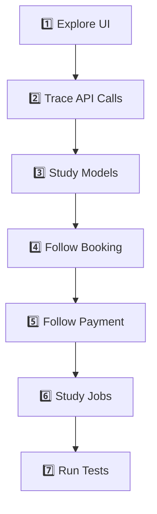
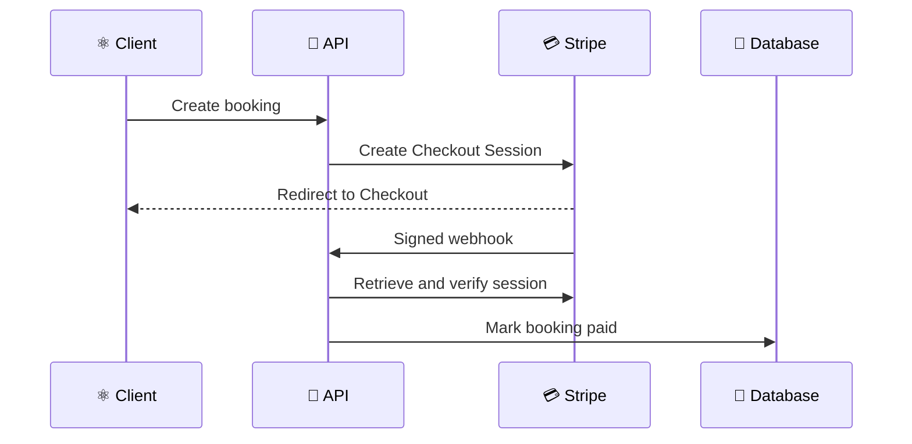

# 🎓 QuickShow Pro — Education Lab

> 📚 A guided learning resource for understanding the engineering concepts, implementation decisions, and production lessons inside QuickShow Pro.

## 🎯 Learning Objectives

After studying this project, you should be able to:

- ⚛️ Explain how a React client communicates with an Express API.
- 🧭 Build public and protected routes with React Router.
- 🔐 authenticate users with Clerk and authorize admins on the server.
- 🍃 model relational application concepts with MongoDB references.
- 💺 design an interactive seat-selection workflow.
- 💳 integrate Stripe Checkout without trusting the browser redirect.
- 🪝 verify and process payment webhooks safely.
- ⚙️ move retryable and scheduled work into Inngest.
- 📨 build confirmation and reminder email workflows.
- 🧪 test payment, reminder, and email-template utilities.
- 🚀 deploy a separated frontend and backend to Vercel.

## 🗺️ Recommended Learning Path



## 1️⃣ Frontend Foundations

### ⚛️ Concepts to Learn

- 🧩 React components and composition.
- 🧠 Context-based shared state.
- 🔄 Effects for remote-data loading.
- 🧭 Parameterized and nested routes.
- ⏳ Authentication and authorization loading states.
- 📝 Controlled inputs for dates, prices, and selections.
- 🔔 User feedback with toast notifications.

### 🔍 Files to Study

| 📁 File | 🎓 Learning Focus |
|---|---|
| `client/src/main.jsx` | Application providers and entry-point composition |
| `client/src/App.jsx` | Route definitions and admin-route protection |
| `client/src/context/AppContext.jsx` | Shared state, authentication tokens, and API calls |
| `client/src/pages/MovieDetail.jsx` | Detail rendering and showtime selection |
| `client/src/pages/SeatLayout.jsx` | Seat state and checkout initiation |
| `client/src/pages/admin/AddShow.jsx` | Forms, movie selection, and scheduling input |

### 🧠 Senior Developer Takeaway

Authentication and authorization are different. Clerk may confirm who the user is, but the application must still decide what that user is allowed to do. The backend remains the final authorization boundary.

## 2️⃣ API and Controller Design

### 🚂 Concepts to Learn

- 🔌 Route modules and controller separation.
- 📥 Request validation.
- 📤 Consistent JSON responses.
- 🛡️ Authentication and authorization middleware.
- ❌ Error handling and appropriate HTTP status codes.
- 🌐 Cross-origin communication.

### 🔍 Files to Study

| 📁 File | 🎓 Learning Focus |
|---|---|
| `server/server.js` | Middleware order and application composition |
| `server/routes/showRoutes.js` | Public and protected show endpoints |
| `server/routes/bookingRoutes.js` | Booking and seat endpoints |
| `server/routes/adminRouter.js` | Protected administration endpoints |
| `server/routes/userRoutes.js` | User-specific resources |
| `server/middleware/auth.js` | Clerk-backed admin authorization |

### 🧠 Senior Developer Takeaway

Routes should describe the HTTP boundary; controllers should coordinate the use case. Avoid placing all business logic directly inside route declarations.

## 3️⃣ Database Modeling

### 🍃 Concepts to Learn

- 🧱 Mongoose schemas and models.
- 🔗 References between collections.
- 🕒 Timestamped documents.
- 🪑 Dynamic occupied-seat maps.
- 🏷️ Enums for controlled payment states.
- 🔍 Population of nested references.

### 🔍 Files to Study

| 📁 File | 🎓 Learning Focus |
|---|---|
| `server/models/User.js` | Clerk-backed user identity |
| `server/models/Movie.js` | External movie data persisted locally |
| `server/models/Show.js` | Scheduled screening and seat occupancy |
| `server/models/Booking.js` | Booking and payment lifecycle |
| `server/models/EmailEvent.js` | Persistent workflow delivery state |

### 🧠 Senior Developer Takeaway

Your data model should represent business truth. A boolean such as `isPaid` is useful, but an explicit payment-state enum makes the lifecycle and failure cases clearer.

## 4️⃣ Booking and Seat Selection

### 🎟️ Booking Process

1. 🎬 The user opens a movie.
2. 📅 The user selects a date and showtime.
3. 💺 The client loads occupied seats.
4. ✅ The user chooses available seats.
5. 📤 The client requests booking creation.
6. 🔒 The server reserves the selected seats.
7. 💳 The user is redirected to Stripe Checkout.

### ⚠️ Engineering Challenges

- 🏁 Two users may attempt to select the same seat.
- 🔄 The UI may show stale availability.
- ⌛ A customer may abandon Checkout.
- 🔁 A request or webhook may be delivered more than once.
- 🌐 The browser may close before returning to the application.

### 🧠 Senior Developer Takeaway

Seat availability is shared mutable state. The server—not the interface—must be the source of truth. At higher scale, reserving seats should become an atomic database operation.

## 5️⃣ Stripe Payment Engineering

### 💳 Correct Payment Principle

> ✅ A successful browser redirect is not proof of payment.

The authoritative flow is:



### 🔍 Files to Study

| 📁 File | 🎓 Learning Focus |
|---|---|
| `server/Controller/bookingController.js` | Booking and Checkout Session creation |
| `server/Controller/stripeWebhook.js` | Signed payment-event handling |
| `server/utils/paymentSync.js` | Reconciliation and payment state transitions |
| `server/scripts/reconcilePaidBookings.js` | Operational recovery workflow |

### 🧠 Senior Developer Takeaway

Webhooks use at-least-once delivery semantics. Your handler must expect duplicates, delayed events, and events received in an unexpected order.

## 6️⃣ Background Jobs with Inngest

### ⚙️ Why Background Jobs?

Some tasks should not block the HTTP response:

- 📨 Sending email.
- ⏰ Waiting until a reminder time.
- 🔁 Retrying temporary failures.
- 🧹 Releasing seats after expiration.
- 👤 Synchronizing external identity events.

### 🔍 File to Study

`server/inngest/index.js` contains the registered durable functions and their event or cron triggers.

### 🧠 Senior Developer Takeaway

Never use an in-memory `setTimeout` for business-critical reminders. A server can restart, scale down, or deploy before the timer fires. Durable workflow systems persist the intended work.

## 7️⃣ Email Reliability

### 📨 Delivery Pattern

1. 🧾 Persist an `EmailEvent`.
2. 🔒 Atomically claim the event.
3. ✉️ Build escaped HTML content.
4. 📤 Send through Brevo SMTP.
5. ✅ Mark the delivery completed.
6. 🔁 Retry safe pending work.

### 🔍 Files to Study

| 📁 File | 🎓 Learning Focus |
|---|---|
| `server/configs/nodemailer.js` | SMTP transport configuration |
| `server/utils/emailTemplates.js` | Safe responsive HTML templates |
| `server/utils/reminders.js` | Reminder scheduling |
| `server/inngest/index.js` | Delivery, retry, and reminder functions |

### 🧠 Senior Developer Takeaway

Exactly-once delivery is usually achieved through idempotency and persistent state—not by assuming an event can only arrive once.

## 8️⃣ Testing Strategy

### 🧪 Existing Test Areas

- 📨 Email-template formatting and escaping.
- 💳 Payment-state synchronization.
- ⏰ Reminder scheduling behavior.

### ▶️ Run the Tests

```bash
cd server
npm test
```

### 📈 Valuable Next Tests

- 🪑 Concurrent seat-reservation tests.
- 🪝 Stripe webhook signature and duplicate-event tests.
- 🛡️ Admin authorization integration tests.
- ❌ Invalid booking payload tests.
- 🔄 Clerk synchronization replay tests.
- 🌐 Frontend route and loading-state tests.

## 9️⃣ Deployment Lessons

### 🚀 Production URLs

- 🎬 Frontend: [quickshowprofront.vercel.app](https://quickshowprofront.vercel.app/)
- ⚙️ API: [quickshowpro.vercel.app](https://quickshowpro.vercel.app/)

### 🧠 Concepts to Understand

- 🌐 The frontend and API have different origins.
- 🔗 `VITE_BASE_URL` connects the client build to the deployed backend.
- 🧭 SPA rewrites allow direct navigation to React routes.
- 📦 The Express application is exported for Vercel's runtime.
- 🪝 Stripe and Inngest need publicly reachable endpoints.
- 🔐 Production secrets must be configured independently for each project.

## 🔟 Active-Learning Questions

### 🟢 Foundation

1. ⚛️ Why are Clerk, Router, and AppContext providers placed near the React entry point?
2. 🧭 What is the difference between a public route and a protected admin route?
3. 🍃 Why does a booking reference both a user and a show?
4. 💺 Why must occupied seats be checked on the server?

### 🟡 Intermediate

1. 💳 Why is the Stripe success redirect insufficient to confirm payment?
2. 🪝 Why must the Stripe webhook route be registered before `express.json()`?
3. ⚙️ Why are movie reminders scheduled through Inngest instead of `setTimeout`?
4. 🔁 How does an email-event claim prevent duplicate messages?

### 🔴 Advanced

1. 🏁 How would you prevent two concurrent requests from reserving the same seat?
2. ♻️ How should the platform recover if Stripe succeeds but the database update temporarily fails?
3. 📊 What observability would you add to trace one booking across HTTP, Stripe, Inngest, and SMTP?
4. 🌍 How would you redesign the system for multiple cinemas, screens, and time zones?

## 🧪 Practical Exercises

- 🟢 Add request validation to booking creation.
- 🟡 Add a booking-cancellation workflow.
- 🟡 Add an admin endpoint for payment reconciliation.
- 🟠 Add structured logging with a booking correlation ID.
- 🟠 Add atomic seat reservation.
- 🔴 Add multi-cinema and multi-screen support.
- 🔴 Add end-to-end tests for the full payment lifecycle.

## 📝 Project Reflection Template

Use these questions after studying a module:

1. 🎯 What business problem does this code solve?
2. 🧠 Which engineering concept does it demonstrate?
3. 🔄 What data enters and leaves the module?
4. ❌ What can fail?
5. 🛡️ How does the code recover or stay consistent?
6. 🧪 How would I prove it works?
7. 📈 How would I improve it for production scale?

## ✅ Education Lab Takeaways

- 🧭 Trace behavior across the entire request lifecycle.
- 🔍 Study failure paths as carefully as successful paths.
- 🛡️ Keep security decisions on the server.
- 💳 Treat external payment state as authoritative.
- ⚙️ Use durable infrastructure for delayed and retryable work.
- 🔁 Build idempotency into integration boundaries.
- 🧪 Convert every important production rule into a test.

